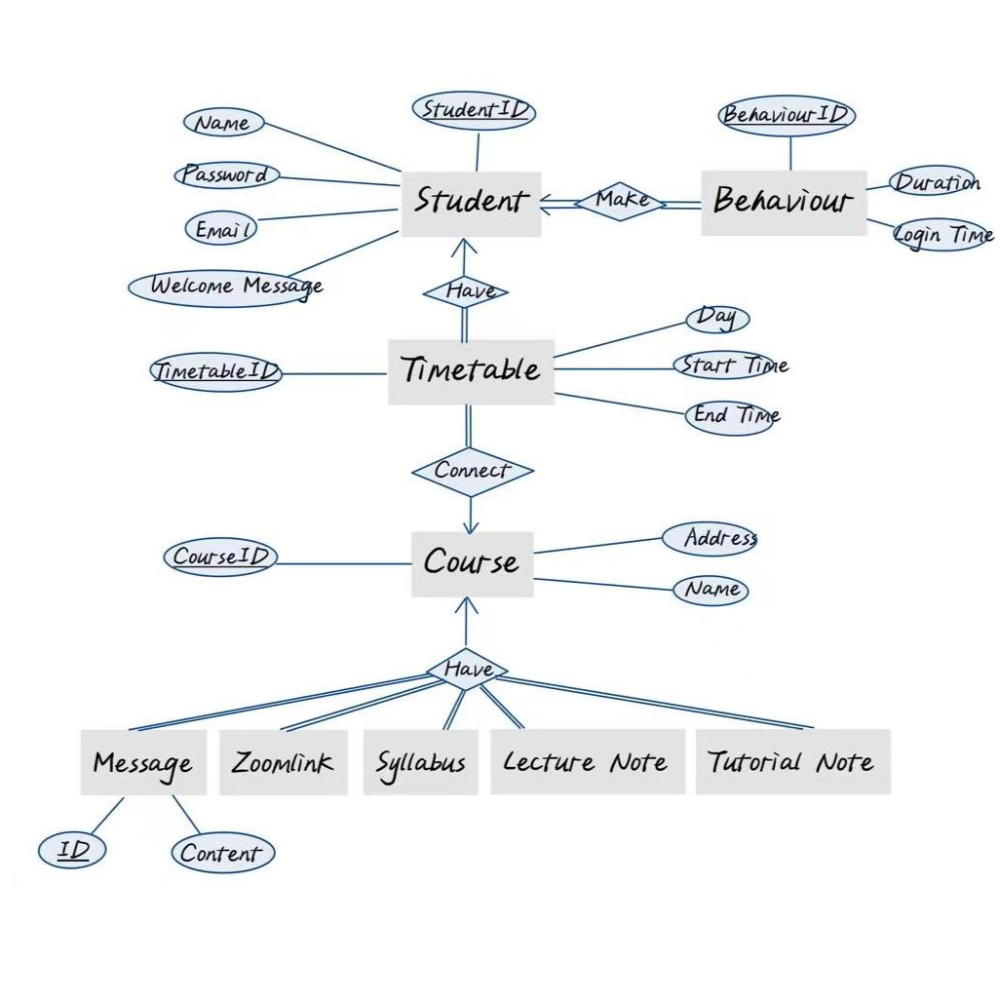
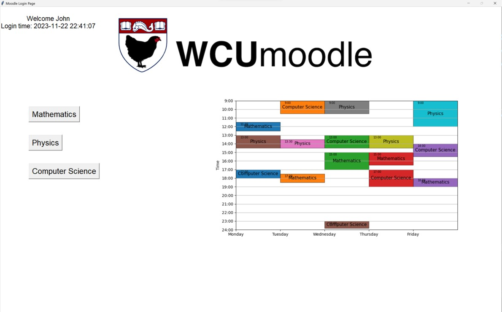
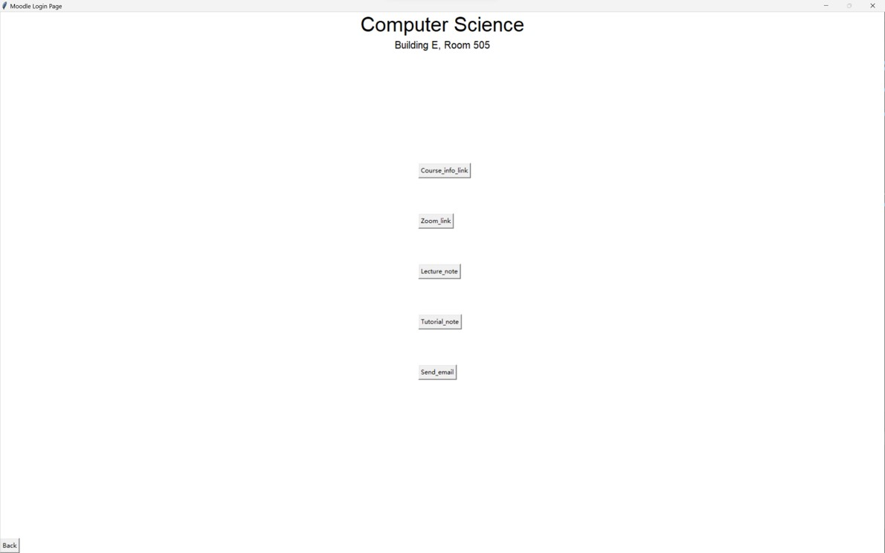
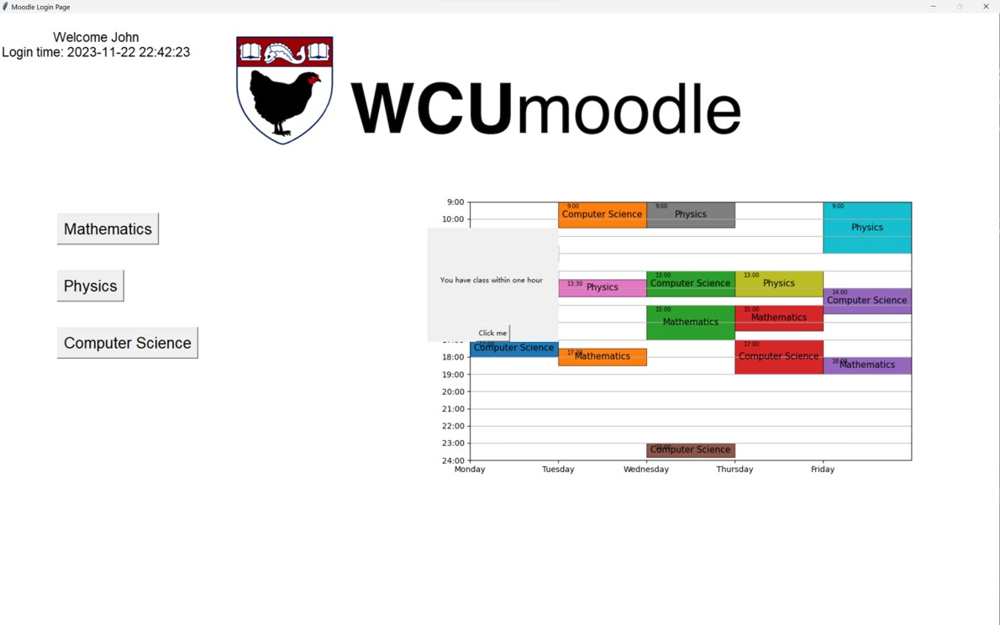

# Intelligent Course Management System (ICMS)

## Overview
The Intelligent Course Management System (ICMS) is a Python and MySQL-based application that provides students with an intuitive graphical user interface (GUI) to manage their course schedules and access essential information. The system leverages face recognition for student login, displays personalized course details, and records user behavior for analysis.

## Features
1. **Facial Login**:
   - Students can log in using facial recognition.
   - After login, the GUI displays the student's name, login time, and a welcome message.
   - The system can check if the student has a class within the next hour and present relevant course details, Zoom links, tutorial/lecture notes, and teacher messages.

2. **Course Information Display**:
   - If a student does not have a class within the hour, the system will display their personal timetable.
   - Students can send their course information (e.g., Zoom links, course notes) to their email via the GUI.

3. **Behavior Tracking**:
   - The system logs and records the student's login times and session durations.

## System Components

### 1. **Face Recognition**
   - Open-source face recognition code is used from GitHub (`face_capture.py` and `train.py`).
   - `face_capture.py` is used to collect face data, which is stored in a directory such as `data/Preston`.
   - `train.py` is run to train the face recognition model using the collected face data.

### 2. **Database Design (MySQL)**
   - A relational database is designed using MySQL to store data, consisting of five tables:
     - **Students Table**: Stores student information.
     - **Courses Table**: Stores course information.
     - **Schedule Table**: Stores the student's course schedule.
     - **Behavior Log Table**: Records student behavior within the system.
     - **Email Sending Table**: Logs information related to email communications.
   - ER Diagram:
   - 

### 3. **Login Interface**
   - The login interface is built using `mysql.connector` to interact with the MySQL database and `PySimpleGUI` to create the GUI.
   - `OpenCV` is used to activate the camera and perform face recognition using the pretrained model.

## System Workflow

1. **Face Recognition and Login**:
   - The system opens the camera and starts face recognition.
   - If a student's face is recognized, their data is retrieved from the database.
   - If a class is scheduled within one hour, the system presents course details, classroom address, teacher’s message, and links to Zoom and other course materials in the GUI.
   - If no class is scheduled within an hour, the system shows the student’s personal class timetable.

## GUI Description

### Home Page
- In the upper right corner, the system displays a personalized welcome message and login time.
- On the left side, all the courses the student has taken are presented as clickable buttons that redirect to the corresponding course pages.
- On the right side, the weekly class schedule is displayed.

### Course Page
- After clicking on a course name, the user is taken to the Course Page. The course name and classroom address are displayed at the top.
- The page contains five main buttons:
  - **Course_info_link**: Redirects to a website with additional course information.
  - **Zoom_link**: Redirects to the course's Zoom session.
  - **Lecture_note**: Redirects to the course's lecture notes.
  - **Tutorial_note**: Redirects to the course's tutorial notes.
  - **Send_email**: Opens the user’s email client and allows them to send course information to themselves.

### Warning Popup
- If a course is scheduled within the next hour, a warning popup will appear after login.
- Clicking **Click_me** in the popup redirects the user to the Course Page for that specific course.

## How to Run the Project

1. Create database  
`create database gp`  
2. Import table schema  
`source create.sql`  
3. Import data  
`source data.sql`  
4. Replace SQL user name and password in main.py   
5. Run main.py  
`python main.py`
